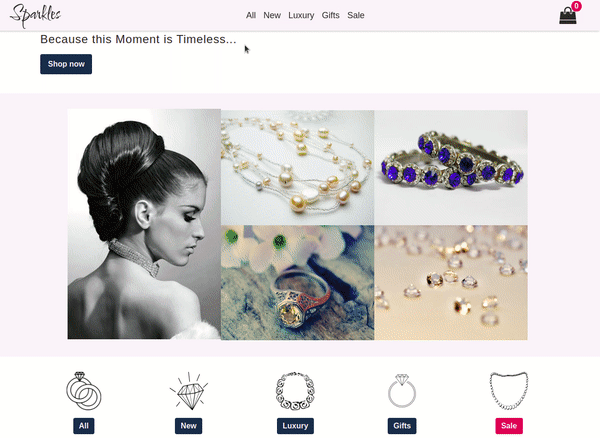
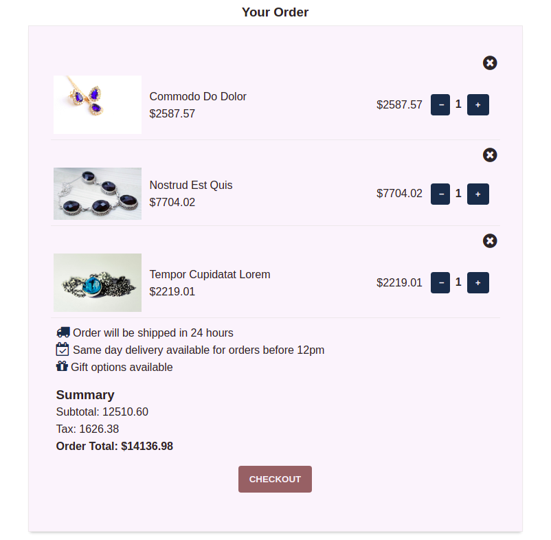

<h1 align="center">
  Sparkles
</h1>
<h3 align="center">Make the life's moments sparkle</h3>
<p align="center">
  
  
  
</p>
<p align="center">
</p>
<h3 align="center"><a  href="https://sparkles-cart.netlify.com/">See live</a></h3>

## Description

A React jewelery shopping cart built using Context API.

## Key Features

User:

- Browse items
- Add/remove from cart
- Update quantities, totals
- Reset cart

## Project Screenshots

<p align="center">
  </p>
 <p align="center">
  
  
  </p>
 <p align="center">
  </p>

## Getting Started

Clone the repository:

```
git clone git@github.com:RReiso/sparkles.git
cd sparkles
```

Install dependencies:

```
npm install
```

Run the app:

```
npm start
```

Open http://localhost:3000 to view it in your browser.

## Dependencies

- lorem-ipsum: ^2.0.4
- random-bool: ^1.0.2
- random-float: ^3.0.0
- react: ^17.0.2
- react-dom: ^17.0.2
- react-router-dom: ^6.2.1
- react-sparkle: ^1.0.9
- sass: ^1.49.7
